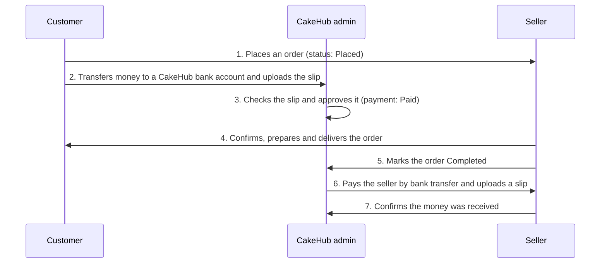

# CakeHub User Guide

CakeHub connects people who want to buy cakes (**customers**) with bakeries and home bakers who sell them (**sellers**). A small team of **admins** looks after the platform: they verify sellers, set up subscription plans and confirm payments.

Pick the guide for your role:

| I am a… | Read | You will learn how to |
|---|---|---|
| **Customer** | [Customer guide](customer-guide.md) | Sign in, find cakes and bakers near you, order, pay by bank transfer, track your order and leave a review |
| **Seller** | [Seller guide](seller-guide.md) | Set up and verify your store, list cakes, handle orders, choose a subscription plan and receive payouts |
| **Admin** | [Admin guide](admin-guide.md) | Verify sellers, manage categories, plans and bank accounts, confirm payments, pay sellers and run homepage ads |

All three roles sign in the same way, with **Google**. CakeHub never asks for or stores a password.

---

## How an order works (all roles)

Payments on CakeHub are **manual bank transfers**. The customer pays the platform, an admin confirms the money arrived, the seller bakes, and the platform then pays the seller.

Important rules that follow from this:

- **A seller cannot move an order forward until an admin has approved the customer's payment.** Until then the seller sees *Awaiting payment verification* instead of the status buttons.
- **Customers pay the platform, not the seller directly.** Sellers are paid after an order is completed (see *Payouts* in the [Seller guide](seller-guide.md)).
- **WhatsApp is always available** as a second way to talk to a seller, for custom designs or questions, but the order itself is placed and paid through CakeHub.
- Prices are shown in dollars (`$`).

## Order statuses

| Status | Meaning |
|---|---|
| **Placed** | The customer has placed the order. |
| **Confirmed** | The seller accepted it. |
| **Preparing** | The seller is baking or decorating. |
| **Ready** | Ready for pick-up or dispatch. |
| **Delivered** | Handed over to the customer. |
| **Completed** | The order is finished. The customer can now leave a review and the seller's payout is created. |
| **Cancelled** | The seller cancelled the order. A seller can cancel only while the order is Placed, Confirmed or Preparing. |

## Payment statuses

| Status | Meaning |
|---|---|
| **Pending** | The order exists but no payment slip has been uploaded yet. |
| **Awaiting verification** | A slip was uploaded and is waiting for an admin to check it. |
| **Paid** | An admin approved the payment. The seller can now process the order. |

## Seller verification statuses

| Status | Meaning |
|---|---|
| **Pending verification** | A new seller. An admin has not reviewed the store yet. |
| **Verified** | Approved by an admin. The store shows a **Verified** badge. |
| **Rejected** | An admin declined verification and gave a reason. |
| **Suspended** | An admin has suspended the store. |

## Subscription statuses (sellers)

| Status | Meaning |
|---|---|
| **Pending** | The seller asked for a plan but the payment has not been approved yet. |
| **Active** | The plan is in force. Its listing limit applies. |
| **Expired** | The plan ran out. The seller falls back to the free plan's listing limit. |
| **Cancelled** | Replaced by a newer plan. |

---

## Frequently asked questions

**Do I need a password?**
No. You sign in with your Google account. If you lose access to your Google account, recover it with Google.

**Which details does CakeHub receive from Google?**
Only your name, email address and profile picture.

**I signed in and was asked "Tell us how you'll use CakeHub". What do I choose?**
Choose *I'm buying cakes* to order cakes, or *I sell cakes* to open a store. Sellers also enter a business name and a WhatsApp number. This choice is made once, at your first sign-in.

**Can one Google account be both a customer and a seller?**
No. Each account has a single role, chosen at first sign-in.

**I paid but my order still says "Awaiting payment verification".**
An admin has to check every payment slip by hand, so this can take a little while. You will get a notification as soon as the order moves on.

**I closed the page before uploading my payment slip. What now?**
The payment step appears right after you place the order, and the order page does not currently offer a way to return to it. Always upload the slip straight away.

**How do I get notifications?**
Use the bell icon at the top of any page. Sellers and admins can also choose which updates arrive by email under **Settings**. In-app notifications always continue.

**I deactivated my account. Can I sign in again?**
No. Deactivation signs you out and blocks sign-in until the platform administrators reactivate the account.
