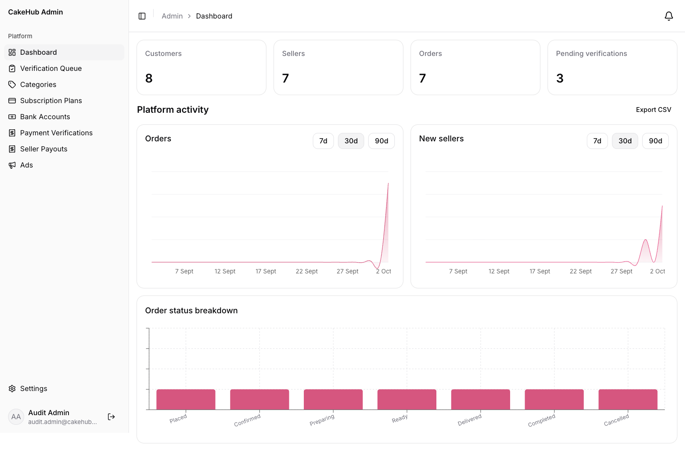
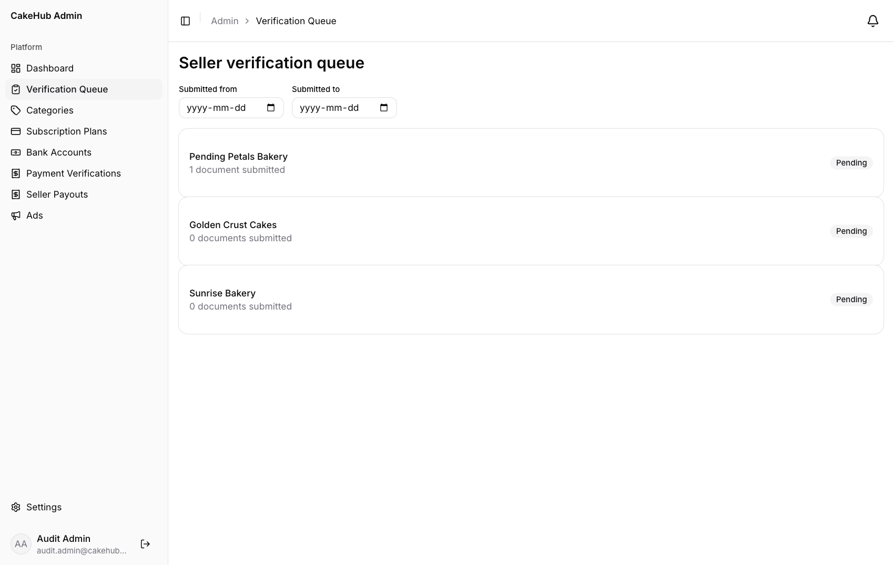
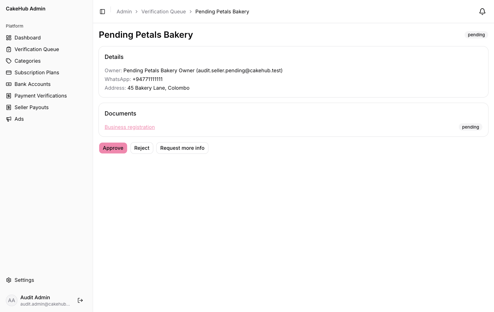
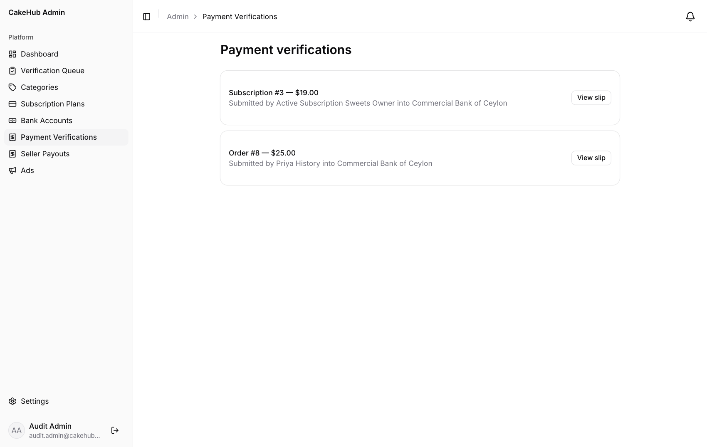
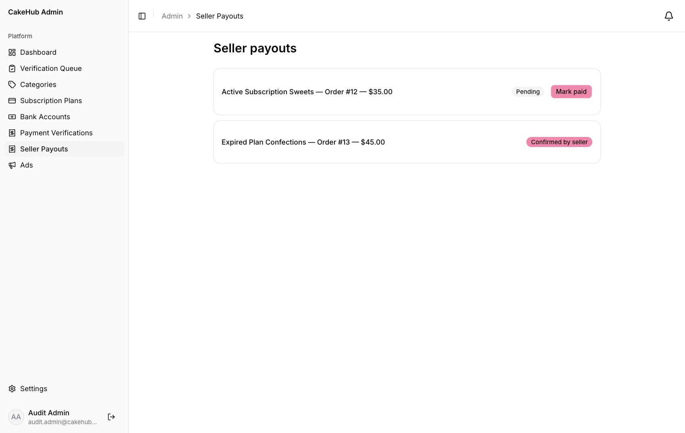
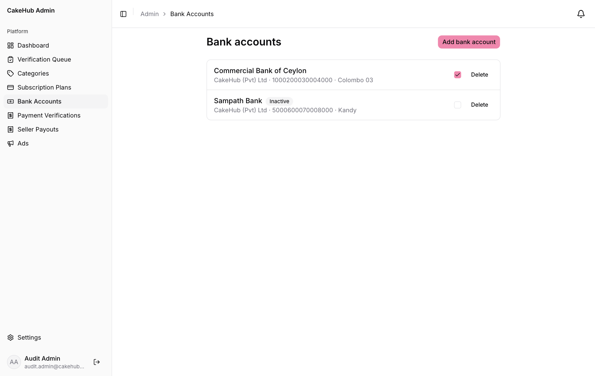
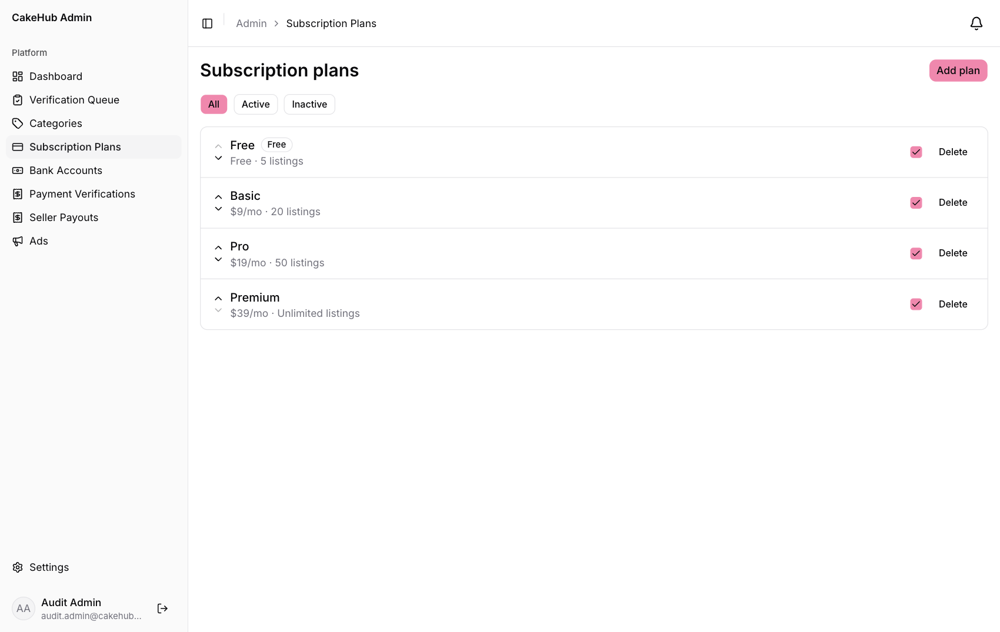
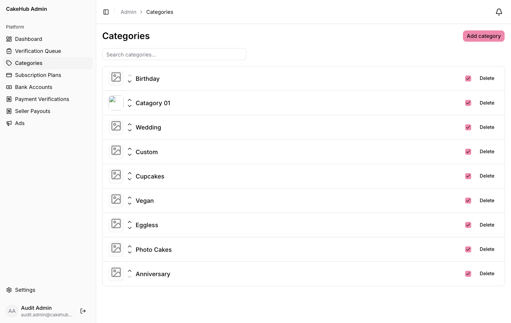
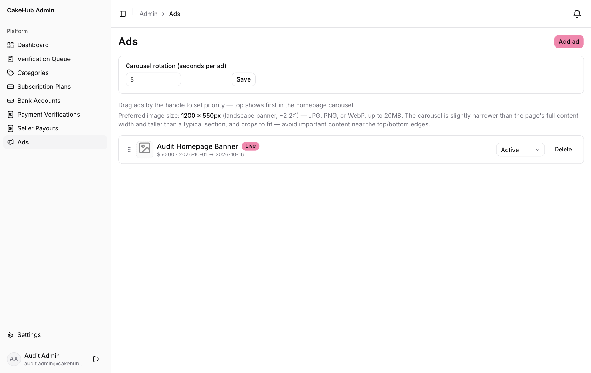
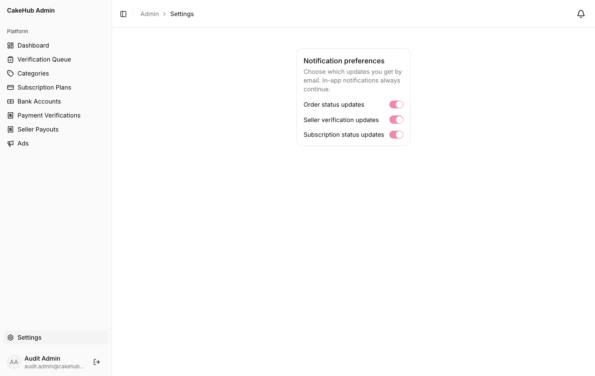

# CakeHub Admin Guide

This guide is for the people who run the CakeHub platform. As an admin you decide which sellers are trusted, keep payments honest, set the subscription plans and keep the storefront tidy.

**On this page**
1. [Signing in as an admin](#1-signing-in-as-an-admin)
2. [The dashboard](#2-the-dashboard)
3. [Verifying sellers](#3-verifying-sellers)
4. [Payment verifications](#4-payment-verifications)
5. [Seller payouts](#5-seller-payouts)
6. [Bank accounts](#6-bank-accounts)
7. [Subscription plans](#7-subscription-plans)
8. [Categories](#8-categories)
9. [Homepage ads](#9-homepage-ads)
10. [Settings and notifications](#10-settings-and-notifications)
11. [Your daily checklist](#11-your-daily-checklist)
12. [For the technical team](#12-for-the-technical-team)

> New to CakeHub? Read [How an order works](README.md#how-an-order-works-all-roles) first. Payments and payouts are manual bank transfers, and you are the person who checks them.

---

## 1. Signing in as an admin

Admins sign in with Google like everyone else, but an account becomes an admin **only if its email address is on the platform's admin list**. There is no admin sign-up screen. To add or remove an admin, ask the technical team (see [section 12](#12-for-the-technical-team)).

1. Open CakeHub and click **Continue with Google**.
2. Choose the Google account whose email is on the admin list.
3. You land on the **Admin dashboard**. You never see the customer/seller role question.

> If you sign in and are asked *"Tell us how you'll use CakeHub"*, the account is not on the admin list yet. Do not choose a role. Ask the technical team to add your email, then sign in again.

The left menu has: **Dashboard, Verification Queue, Categories, Subscription Plans, Bank Accounts, Payment Verifications, Seller Payouts, Ads** and, at the bottom, **Settings**. Click the sign-out icon next to your name to leave.

---

## 2. The dashboard

- **Customers, Sellers, Orders, Pending verifications:** headline numbers. A growing *Pending verifications* number means sellers are waiting for you.
- **Platform activity:** two charts, **Orders** and **New sellers**. Use **7d**, **30d** or **90d** to change the period.
- **Order status breakdown:** how many orders are in each status.
- **Export CSV** downloads a spreadsheet with orders and new sellers per day, and the order status counts.

---

## 3. Verifying sellers

New sellers start as **Pending verification**. Your job is to confirm they are real businesses before they get the **Verified** badge.

### Review the queue

Click **Verification Queue**.

Each row is a seller waiting for review, with how many documents they have submitted. Use **Submitted from** and **Submitted to** to filter by date. Click a seller to open their details.

### Review one seller

The page shows the **Owner**, **WhatsApp** number and **Address**, and a **Documents** list (Business registration, Food safety certificate, Address proof). Click a document name to open the file.

Then choose one action:

| Action | When to use it | What happens |
|---|---|---|
| **Approve** | The business and documents look genuine. | A confirmation dialog (*Approve this seller?*) appears. After you click **Approve**, the store gets the **Verified** badge and the seller is notified. |
| **Reject** | The documents are invalid or the business can't be confirmed. | A **Reason** box opens. The reason is **required** and is shown to the seller, so make it clear and actionable. |
| **Request more info** | Something is missing or unclear. | Type what you need in the box. The seller is sent your message as a notification. Their status stays **Pending**, and they can add documents. |

### Suspend a seller

For a seller who breaks the rules, open their page and click **Suspend seller**, then confirm in the **Suspend this seller?** dialog. The seller is notified that their store was suspended and should contact support.

> **Decisions are one-way in the admin panel.** The **Approve / Reject / Request more info** buttons only appear while a seller is *Pending*. **Suspend seller** appears for sellers who are not already suspended or pending. There is currently no button to reverse a rejection or suspension, so decide carefully. Ask the technical team if a decision has to be reversed.

---

## 4. Payment verifications

Every customer order and every seller subscription is paid by bank transfer, and **you confirm that the money arrived**. Nothing proceeds until you do:

- A seller cannot move an order past *Placed* until its payment is approved.
- A seller's new subscription stays *Pending* until its payment is approved.

Click **Payment Verifications**.

Each row shows what was paid for (*Order #8* or *Subscription #3*), the amount, who submitted it and which CakeHub bank account they say they paid into.

### Check a payment

1. Click **View slip** to open the uploaded receipt.
2. Open your bank statement and check that the amount really arrived in the **bank account shown**. Compare the amount and the customer's reference (if any).
3. Then:
   - **Approve** if the money is there.
   - **Decline** if it is not. A box asks for a **Reason for declining**, which is required. Click **Confirm decline**.

### What Approve does

| Paid for | Effect |
|---|---|
| **An order** | The order's payment becomes **Paid**, so the seller can confirm and process it. |
| **A subscription** | The seller's plan becomes **Active** now, with an end date one month or one year ahead depending on the plan's billing cycle. Any earlier active plan of theirs is cancelled. The new listing limit applies immediately, and the seller is notified. If the new plan has a *lower* listing limit, the extra, most recently created listings are hidden. |

### What Decline does

Declining marks the payment as rejected and records your reason. **It does not send the customer or seller a notification, and the order or subscription is not reset.** Contact the person directly (for example by WhatsApp or email) to explain and arrange a new transfer.

> Slips can be images or PDFs. Be careful with slips that look edited, show a different amount or name another bank account. Only approve once the money is in your account.

---

## 5. Seller payouts

When a seller marks an order **Completed**, CakeHub creates a **payout** for that order's total. You pay the seller by bank transfer outside CakeHub, then record it here.

Click **Seller Payouts**.

Each payout shows the seller, the order, the amount and its status:

| Status | Meaning |
|---|---|
| **Pending** | The order is completed and the seller is waiting for their money. |
| **Paid** | You have paid and uploaded the slip. The seller has not yet confirmed. |
| **Confirmed by seller** | The seller confirmed they received the money. Nothing more to do. |

### Pay a seller

1. Transfer the amount to the bank account the seller saved under **Settings → Payout details**.
2. On the **Pending** payout, click **Mark paid**.
3. In the **Mark payout as paid** dialog, upload the transfer **Payment slip** (JPG, PNG, WebP or PDF, up to 10 MB), then click the confirm button.
4. The payout becomes **Paid**. The seller can open the slip with **View slip** and clicks **Confirm received**.

> The payout amount equals the order total. CakeHub does not deduct a commission at this stage.

---

## 6. Bank accounts

These are the CakeHub bank accounts that customers and sellers transfer money into. Only **active** accounts are shown to them on the payment screens.

Click **Bank Accounts**.

- **Add bank account:** enter **Bank name**, **Account name**, **Account number** and, optionally, **Branch**. New accounts are active.
- **Active switch:** turn it off to hide an account from customers and sellers without deleting it. Existing payments keep their record.
- **Delete:** removes the account after you confirm (*This cannot be undone*).

Keep **at least one active account** at all times. If none is active, customers and sellers have nowhere to pay.

> There is no *Edit* button. To change an account's details, add the corrected account and switch the old one off.

---

## 7. Subscription plans

Plans decide how many cakes a seller can list. They are fully managed here. Changing a price or limit never needs a software update.

Click **Subscription Plans**.

The list shows each plan's name, price, billing and listing limit. A plan with a price of 0 gets a **Free** badge. Use **All / Active / Inactive** to filter.

### Add a plan

1. Click **Add plan**.
2. Fill in:
   - **Name**
   - **Price (0 = free)**
   - **Billing cycle:** **Monthly** or **Annual** (not needed for free plans)
   - **Listing limit (blank = unlimited)**
3. Save. The plan appears at the bottom of the list and is active.

### Manage existing plans

- **Order:** use the **up and down arrows** to change the order in which plans are shown to sellers.
- **Active checkbox:** untick to hide a plan from new subscribers without affecting sellers who already have it. Tick it again to bring it back.
- **Delete:** if the plan has active subscribers, you are asked to **choose a migration target**, the plan they move to. Choose one so nobody is left without a plan, then confirm.

> **Always keep one active free plan.** Sellers with no paid plan, or whose paid plan expires, fall back to the active plan priced at 0. If there is none, they get no listing limit at all.

### Things to know

- There is no *Edit* button for a plan's price or limit. To change pricing, add a new plan with the new values, then switch the old one to inactive (or delete it, choosing the new plan as the migration target).
- Plans you add here do not include **sales analytics**. The dashboard charts for sellers are part of the standard Pro and Premium plans only.
- Listing limits are enforced for every seller. If a plan's limit is lowered, or a seller moves to a smaller plan, the most recently created extra listings are hidden, not deleted.
- Subscriptions that run out are expired automatically once a day, and the seller is told.

---

## 8. Categories

Categories (Birthday, Wedding, Cupcakes…) are how customers browse and how sellers tag cakes.

Click **Categories**.

- **Search categories:** find one quickly.
- **Add category:** click it, type the **Name**, and save.
- **Image:** use the upload button on a category's row to give it a picture for the home page.
- **Active switch:** switch off to hide a category from customers. An **Inactive** label appears.
- **Up and down arrows:** change the order categories appear in.
- **Delete:** removes the category from every product it was assigned to (*This cannot be undone*).
- A **Seller-added** badge marks categories that a seller created while listing a cake. Review these and delete duplicates or inappropriate names.

---

## 9. Homepage ads

Ads are banners that rotate at the top of the customer home page.

Click **Ads**.

- **Add ad:** enter **Name**, optional **Description** and **Link URL**, **Paid amount** (what the advertiser paid), **Start date** and **End date**.
- **Image:** upload a banner. The preferred size is **1200 × 550 px** (landscape).
- **Status:** **Draft**, **Active** or **Paused**. An ad is shown to customers (and marked **Live**) only when it is **Active** *and* today falls between its start and end dates.
- **Order:** drag an ad by its handle. The ad at the top is shown first.
- **Carousel rotation (seconds per ad):** how long each ad stays on screen before the next one appears.
- **Delete** removes the ad and its image.

---

## 10. Settings and notifications

Click **Settings** at the bottom of the left menu to choose which updates you receive by email. In-app notifications (the bell icon) always continue.

---

## 11. Your daily checklist

1. **Payment Verifications:** clear the queue. Customers and sellers are waiting on you.
2. **Verification Queue:** review new sellers.
3. **Seller Payouts:** pay out *Pending* payouts and upload the slips.
4. **Categories:** check for new *Seller-added* categories.
5. **Dashboard:** check the numbers.

---

## 12. For the technical team

This section is for whoever deploys and maintains CakeHub, not for day-to-day admins.

- **Admin list:** admins are the Google accounts listed in the `ADMIN_EMAILS` environment variable (comma-separated). A user gets the admin role at sign-in if their email is on the list and they have no role yet. A user who already chose *customer* or *seller* before being added is **not** converted by simply being added. They need their role changed in the database.
- **Daily expiry job:** subscriptions are expired by the scheduled command `app:expire-seller-subscriptions`, which runs daily. The Laravel scheduler (`php artisan schedule:run` every minute, or `schedule:work`) must be running in production.
- **Payment slips** are stored privately on the server and are only shown to the people involved and to admins.
- Full deployment steps are in [../deployment.md](../deployment.md).
