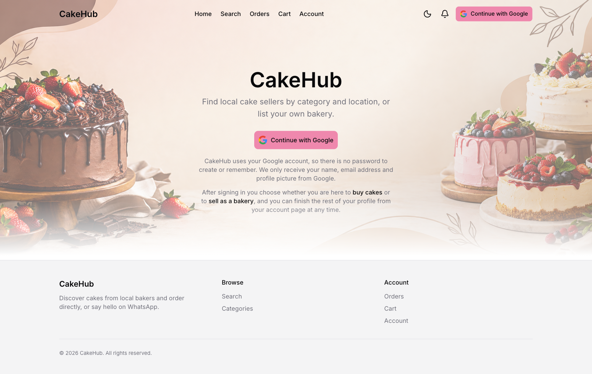
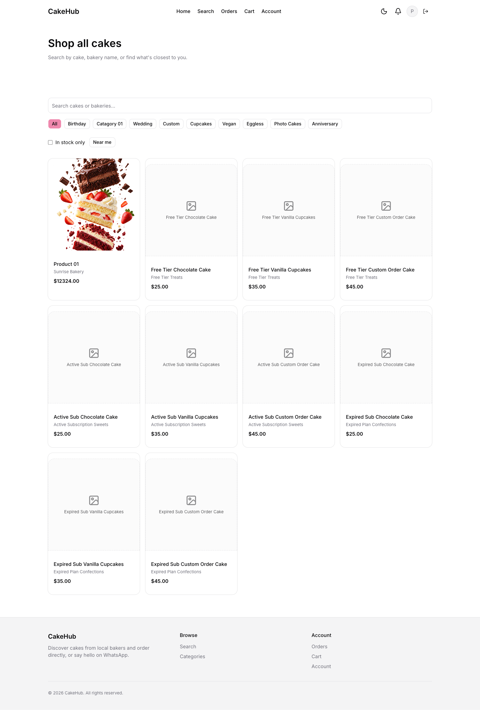
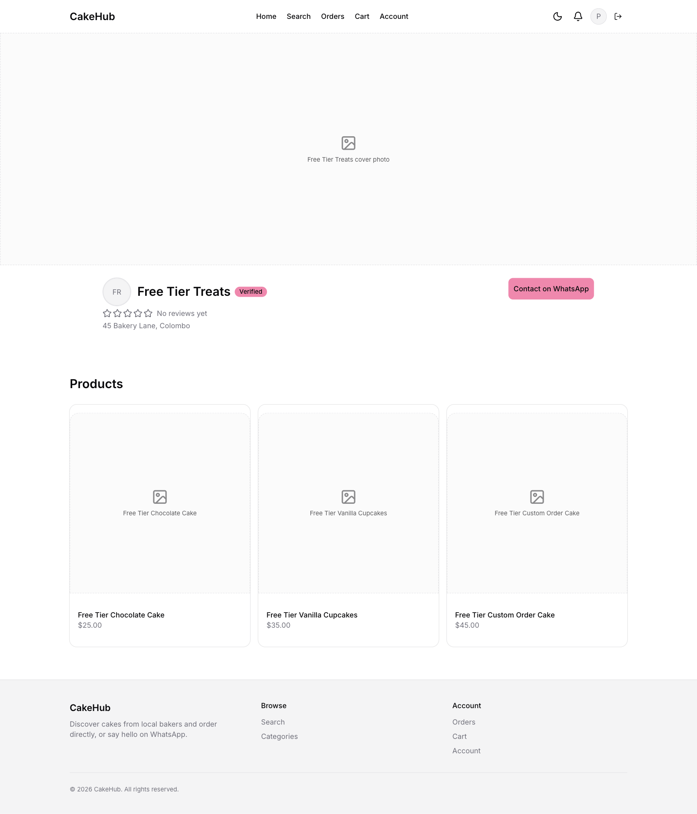
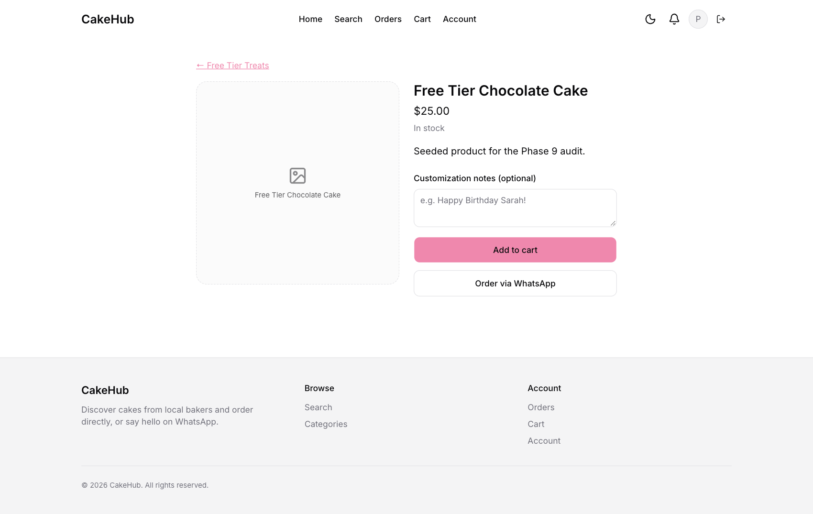
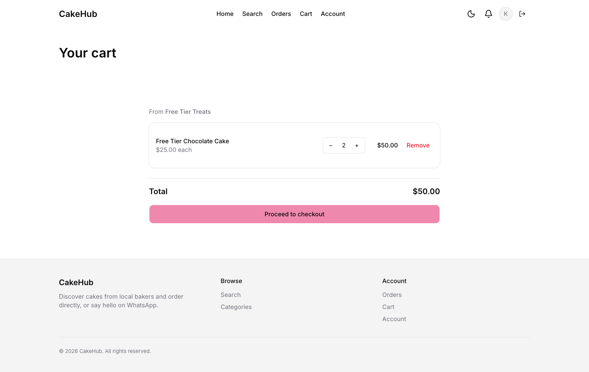
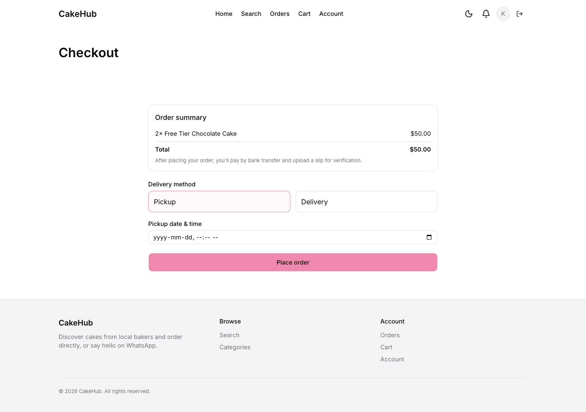
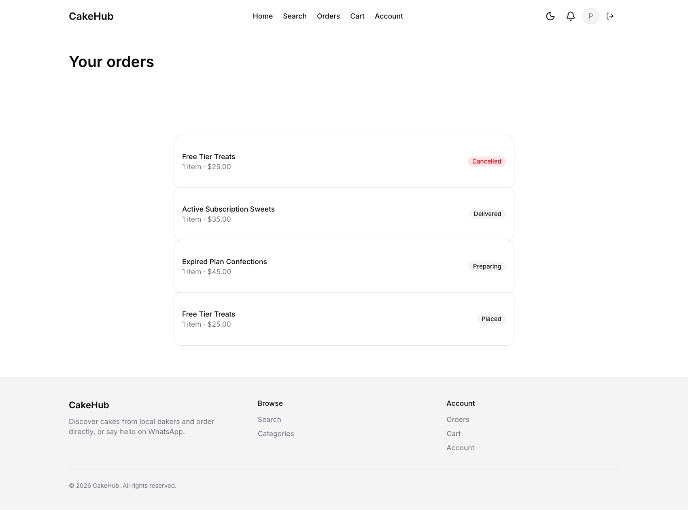
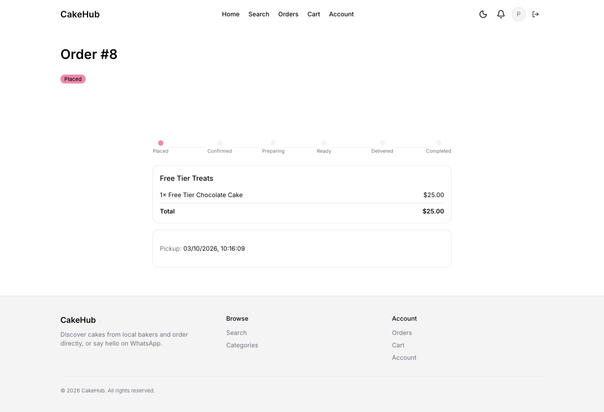
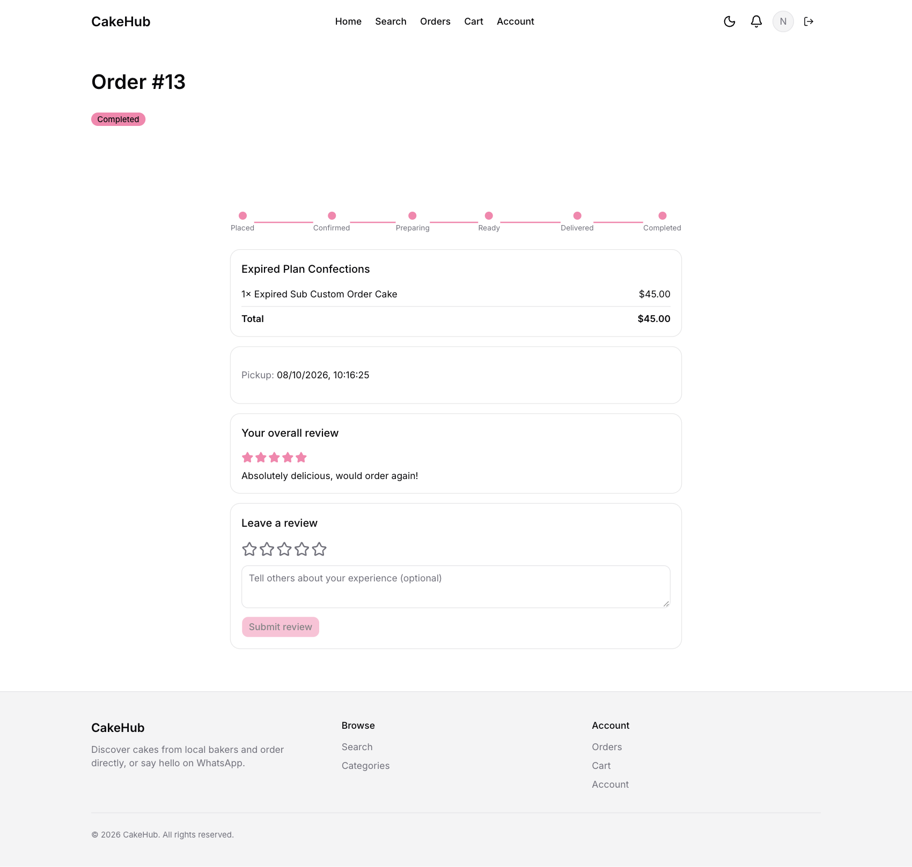
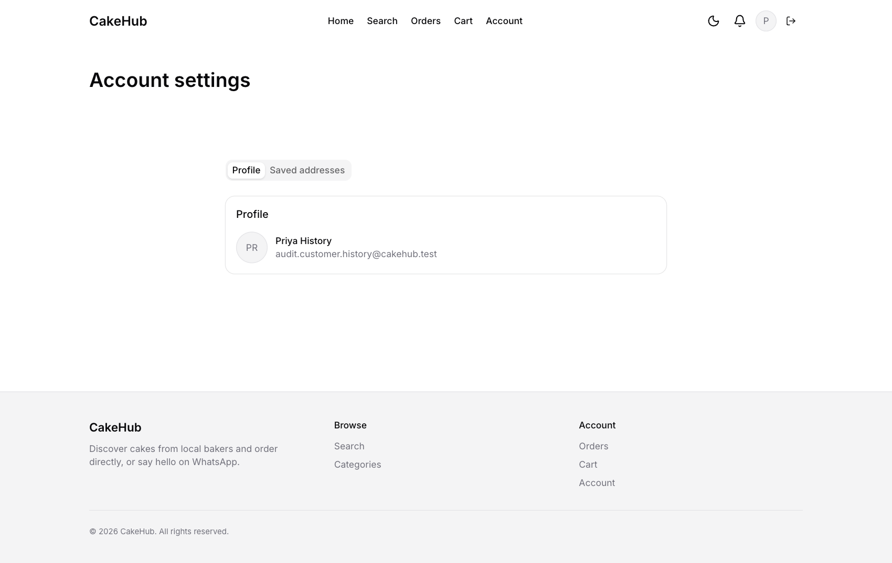

# CakeHub Customer Guide

This guide shows you how to find a cake, order it, pay and follow your order from start to finish.

**On this page**
1. [Signing in](#1-signing-in)
2. [Finding cakes and bakers](#2-finding-cakes-and-bakers)
3. [Visiting a baker's store](#3-visiting-a-bakers-store)
4. [Choosing a cake and adding it to your cart](#4-choosing-a-cake-and-adding-it-to-your-cart)
5. [Checking out and paying](#5-checking-out-and-paying)
6. [Tracking your orders](#6-tracking-your-orders)
7. [Leaving a review](#7-leaving-a-review)
8. [Your account and addresses](#8-your-account-and-addresses)
9. [Notifications](#9-notifications)
10. [Troubleshooting](#10-troubleshooting)

---

## 1. Signing in

CakeHub uses your Google account. There is no password to create or remember.

1. Open CakeHub and click **Continue with Google**.
2. Choose your Google account and allow access. CakeHub only receives your name, email address and profile picture.
3. The first time you sign in you are asked *"Tell us how you'll use CakeHub."* Choose **I'm buying cakes**.

> **Note:** You choose your role once. If you meant to open a bakery, use a different Google account for your store.

To sign out, click the **sign-out icon** (an arrow leaving a box) at the right of the top bar.

---

## 2. Finding cakes and bakers

After signing in you land on the **Home** page. The top bar always shows **Home**, **Search**, **Orders**, **Cart** and **Account**.

From Home you can:

- Click **Shop now** to browse every cake from every baker.
- Browse **Categories** (Birthday, Wedding, Cupcakes, Vegan and so on) and **Featured bakers**.
- Switch on **Near me** to see bakers close to you. Your browser asks permission to use your location. Allow it to see nearby results.
- If a banner is running, the carousel at the top shows it.

### Search for bakeries

Click **Search** in the top bar to search bakeries.

- Click a **category chip** to show only bakers who sell that kind of cake. **All** clears the category.
- Use **Min price**, **Max price** and **Min rating** to narrow the list.
- Click **Near me** to sort by distance from your location, or switch from **List** to **Map** to see bakers on a map.
- A **Verified** badge on a card means an admin has checked that baker's business details.

### Shop all cakes

**Shop now** (or **/products**) lists individual cakes rather than bakers.

Search by cake name, description or baker's name, filter by category, show *in stock* cakes only, or use *near me*.

---

## 3. Visiting a baker's store

Click any baker to open their storefront.

You will see the baker's cover photo and logo, the **Verified** badge (if they have one), their star rating, address and every cake they currently sell.

**Contact on WhatsApp** opens a WhatsApp chat with the baker with a ready-made greeting. Use it for custom designs, special requests or questions before you order. You can always do this instead of, or as well as, ordering through CakeHub.

---

## 4. Choosing a cake and adding it to your cart

Click a cake to open its page.

1. If the cake has **Options** (for example a size or flavour), pick one. The price updates to match.
2. Type any wishes into **Customization notes**, for example *Happy Birthday Sarah!*.
3. Click **Add to cart**.

Cakes marked **Made to order** are baked after you order, so allow time for them. A cake marked **Currently unavailable** cannot be ordered.

The same page has **Order via WhatsApp** if you would rather arrange the order by chat.

### One baker per cart

Your cart can hold cakes from **one baker at a time**. If you add a cake from a different baker, CakeHub asks **Start a new cart?**:

- **Cancel** keeps your current cart as it is.
- **Replace cart** empties your current cart and starts a new one with the new cake.

### Reviewing your cart

Click **Cart** in the top bar.

Use the **−** and **+** buttons to change quantities, or click **Remove** (and confirm) to take an item out. The **Total** is shown at the bottom. When you are ready, click **Proceed to checkout**.

---

## 5. Checking out and paying

### Step 1: choose pick-up or delivery

Click **Proceed to checkout** in your cart.

1. **Delivery method:** choose **Pickup** (you collect the cake from the baker) or **Delivery**.
2. If you chose **Delivery**, select one of your saved addresses. Add one first under [Account](#8-your-account-and-addresses) if you have none.
3. Pick the **date & time** you want the cake. It must be in the future, and made-to-order cakes need enough lead time.
4. Click **Place order**.

> **Note:** Delivery and pick-up arrangements are handled by the baker. CakeHub records your address and time slot. No delivery fee is added at checkout.

### Step 2: pay by bank transfer

Right after you place the order, the **Pay for your order** step appears. CakeHub does not take card payments. You pay by **bank transfer**:

1. Transfer the order total to one of the CakeHub bank accounts listed on the page. Select the account you paid into.
2. *(Optional)* Type your **Bank reference**.
3. Under **Payment slip (image or PDF)**, upload a photo, screenshot or PDF of your transfer receipt. Files up to 10 MB are accepted.
4. Click **Submit payment slip**.

> **Do this straight away.** The order page does not currently offer a way back to this step. If you close the page before uploading the slip, your order stays unpaid.

You are taken to your order page, which shows **Awaiting payment verification**. An admin checks the slip by hand. When the payment is approved, the order shows as paid and the baker can start work. You also receive a notification.

---

## 6. Tracking your orders

Click **Orders** to see everything you have ordered, newest first. Click an order to open it.

An order that is waiting for payment approval looks like this:

An order page shows:

- A **progress bar**: Placed → Confirmed → Preparing → Ready → Delivered → Completed.
- The baker, the items, the **Total** and your pick-up or delivery details.

You receive a notification (and an email) each time the baker moves your order to a new status. See the [status list](README.md#order-statuses) for what each one means.

> **Cancelling:** customers cannot cancel an order themselves. Message the baker on WhatsApp from their storefront if you need to change or cancel an order. The baker can cancel an order while it is still Placed, Confirmed or Preparing.

---

## 7. Leaving a review

Once an order is **Completed**, a **Leave a review** box appears on the order page.

1. Choose **Overall experience** (or one particular item from the order).
2. Click the stars to give 1 to 5.
3. Optionally write about your experience.
4. Click **Submit review**.

Good to know:

- You can only review **completed** orders.
- Each order can have **one overall review**, and each item on it can be reviewed once.
- The baker may post a public **Seller response** under your review.
- Reviews update the baker's and the cake's average rating.

---

## 8. Your account and addresses

Click **Account** in the top bar.

- **Profile** shows your name and email. These come from your Google account.
- **Saved addresses** lists your delivery addresses. To add one, fill in a **Label** (for example *Home*), the **Address line** and **City**, optionally drop a pin on the map, then click **Add address**. Click **Remove** next to an address to delete it. If you need to change an address, remove it and add it again.

---

## 9. Notifications

The **bell icon** in the top bar lists your latest notifications, such as order status changes. Open the bell to read them and mark them as read.

---

## 10. Troubleshooting

| Problem | What to do |
|---|---|
| My order says **Awaiting payment verification** for a long time | Admins check every slip manually. Wait for the notification. If it takes unusually long, message the baker on WhatsApp. |
| I can't add a cake to my cart | The cake may be **Currently unavailable**. Try another cake or message the baker. |
| "Your cart has items from a different seller" | Your cart holds one baker's cakes. Choose **Replace cart** to switch baker, or **Cancel** to keep the current cart. |
| Checkout says my date is invalid | The pick-up or delivery time must be in the future. |
| I don't see any bakers near me | Allow location access in your browser, or search by category without **Near me**. |
| I can't sign in and see "This account has been deactivated" | Your account was deactivated or suspended. Contact the platform administrators. |
