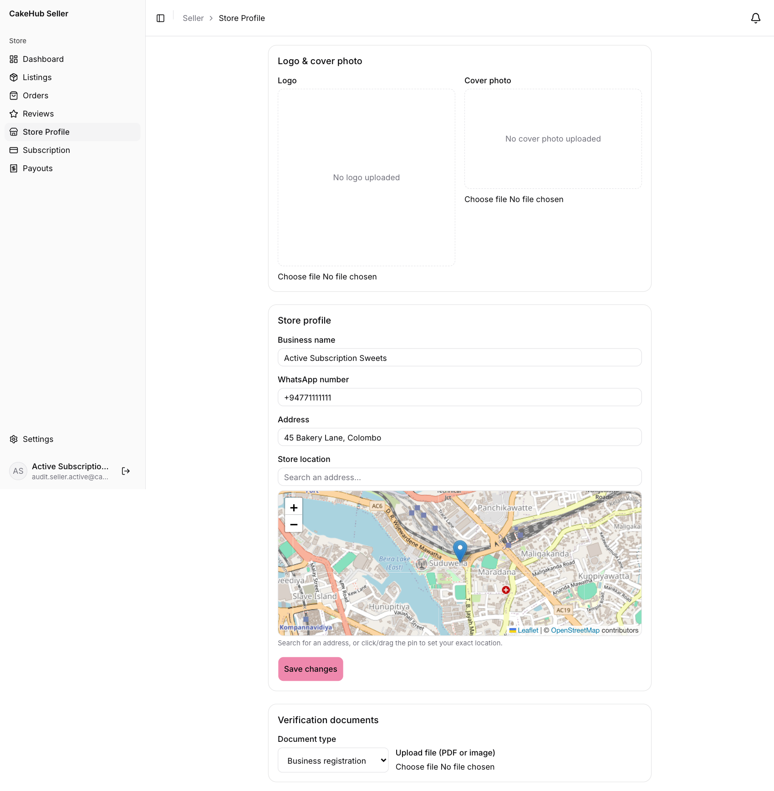
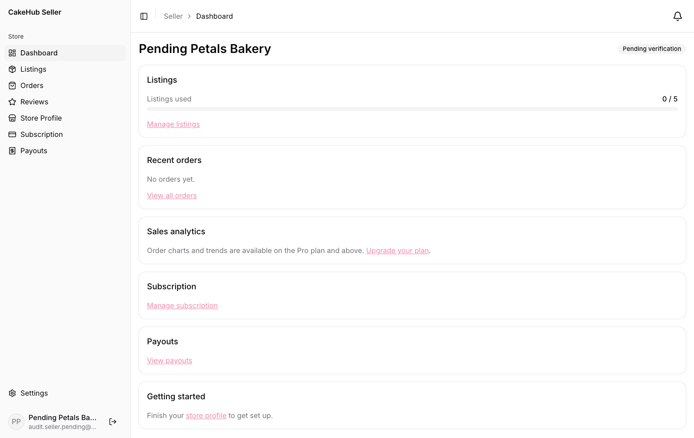
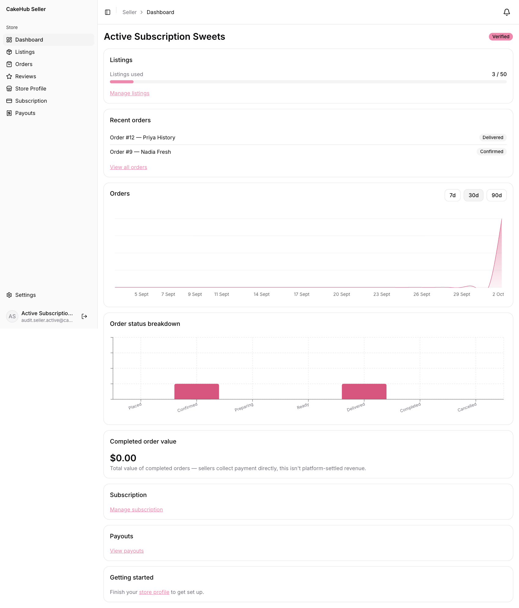
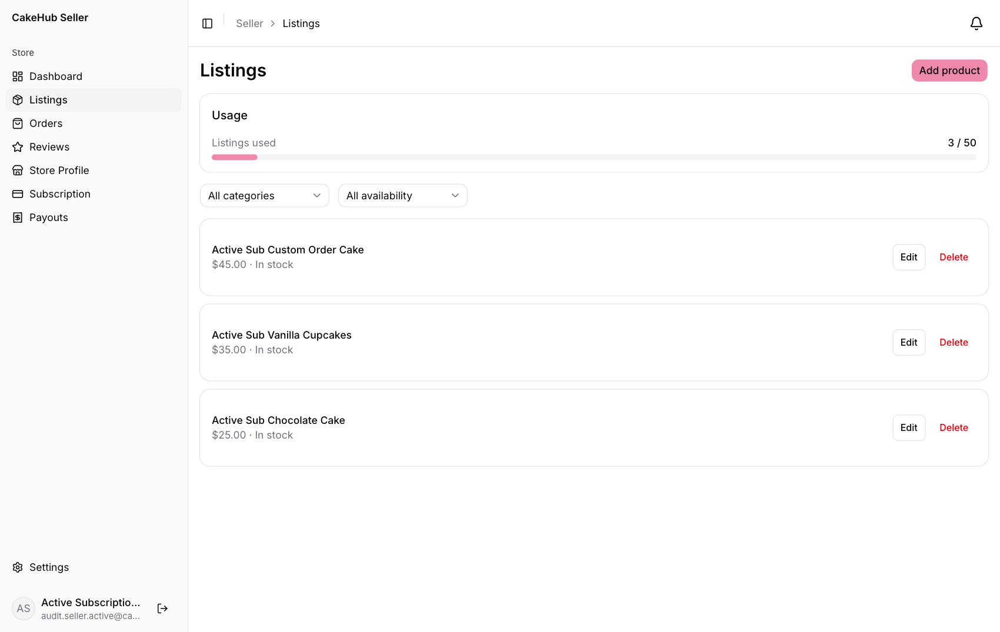
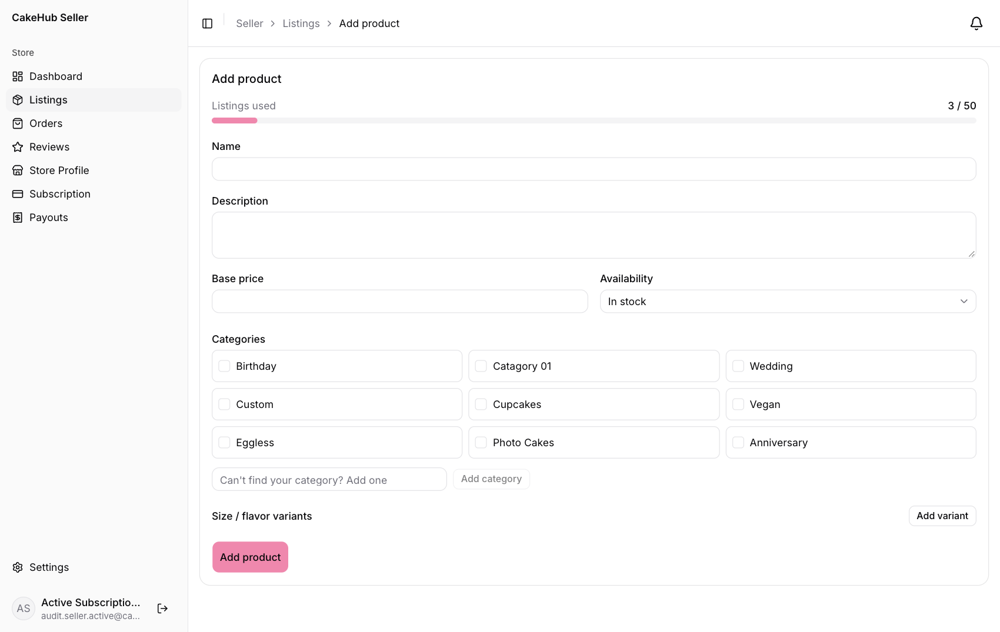
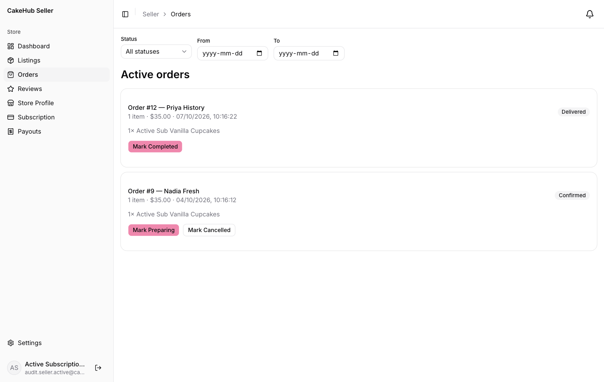
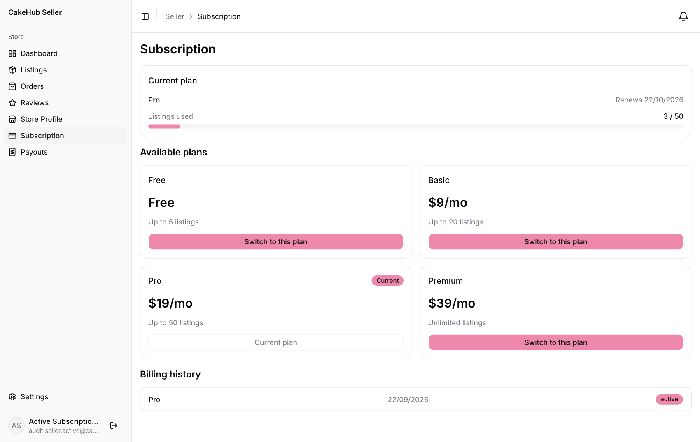
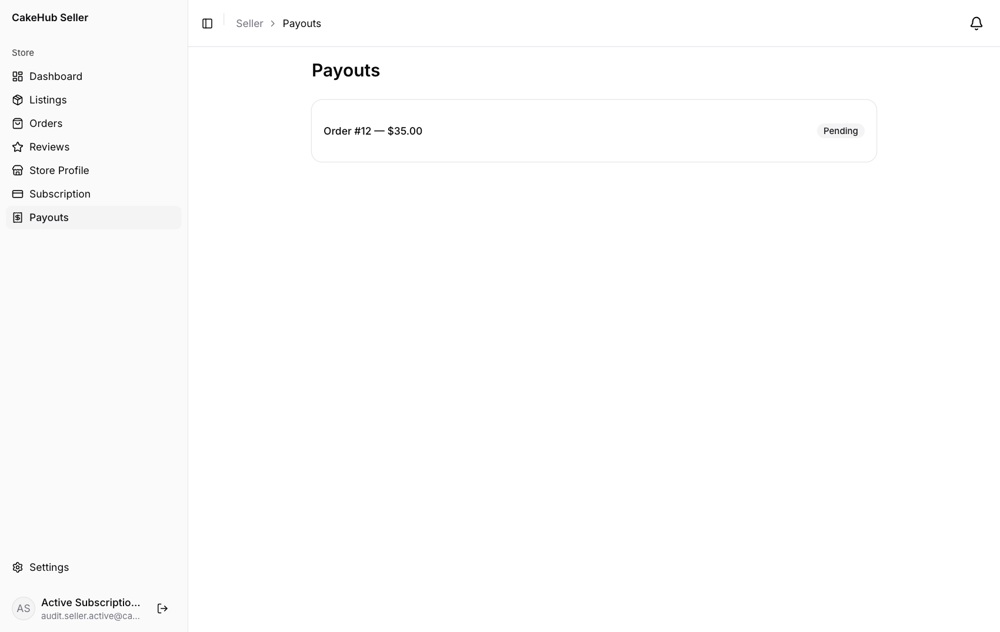
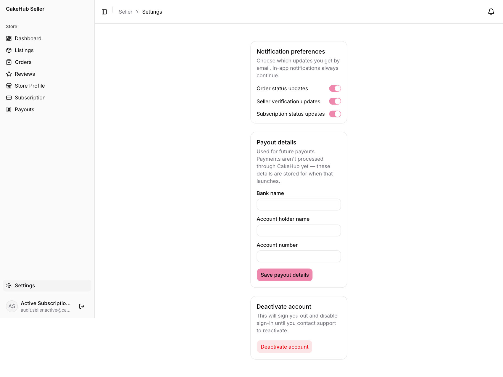

# CakeHub Seller Guide

This guide is for bakeries and home bakers who sell cakes on CakeHub. It takes you from signing up to getting paid.

**On this page**
1. [Getting started](#1-getting-started)
2. [Getting verified](#2-getting-verified)
3. [The seller dashboard](#3-the-seller-dashboard)
4. [Your store profile](#4-your-store-profile)
5. [Listing your cakes](#5-listing-your-cakes)
6. [Handling orders](#6-handling-orders)
7. [Reviews](#7-reviews)
8. [Subscription plans and the listing limit](#8-subscription-plans-and-the-listing-limit)
9. [Payouts: how you get paid](#9-payouts-how-you-get-paid)
10. [Settings and notifications](#10-settings-and-notifications)
11. [Troubleshooting](#11-troubleshooting)

---

## 1. Getting started

1. Open CakeHub and click **Continue with Google**. There is no password. Use the Google account you want to run the store from.
2. At first sign-in you are asked *"Tell us how you'll use CakeHub."* Choose **I sell cakes**.
3. Enter your **Business name** and your **WhatsApp number** (include the country code, for example `+94 77 123 4567`). Customers use this number to message you, so make sure it is the one you check.
4. Click **Continue**. You land on your seller dashboard.

> **Note:** Your role is chosen once. If you pick **I'm buying cakes** by mistake, you cannot switch that account to a seller account.

Your store starts on the **free plan** and with **Pending verification** status. Work through [Getting verified](#2-getting-verified) and [Your store profile](#4-your-store-profile) next.

The left menu has everything you need: **Dashboard, Listings, Orders, Reviews, Store Profile, Subscription, Payouts** and, at the bottom, **Settings**.

---

## 2. Getting verified

Verification is how CakeHub shows customers that your business is real. Verified stores get a **Verified** badge on their storefront and in search results, and only verified, open stores are eligible for the **Featured bakers** section on the home page.

### Upload your documents

1. Go to **Store Profile** and scroll to **Verification documents**.
2. Choose the **Document type**:
   - **Business registration**
   - **Food safety certificate**
   - **Address proof**
3. Under **Upload file (PDF or image)**, choose a PDF, JPG or PNG (up to 10 MB), then upload it.
4. Repeat for each document you have.

### What happens next

An admin reviews your store. You are told the result through a notification (and email, unless you turned that off):

| Result | What it means | What you do |
|---|---|---|
| **Verified** | Approved. The badge appears on your store. | Nothing. You are all set. |
| **More information needed** | The admin sent you a message saying what is missing. Your status stays *Pending*. | Read the notification and upload the extra documents. |
| **Rejected** | The admin declined verification and gave a **reason**. | Read the reason in your notification. Contact the platform administrators to discuss next steps. |
| **Suspended** | An admin suspended your store. | Contact the platform administrators. |

Your current status is always shown as a badge at the top right of your dashboard.

---

## 3. The seller dashboard

Click **Dashboard** to see how your store is doing.

- **Listings:** how many of your plan's listings you have used (for example *3 / 50*). Click **Manage listings**.
- **Recent orders:** your latest orders with their status. Click **View all orders**.
- **Orders** chart, **Order status breakdown** and **Completed order value:** the sales analytics. Use **7d**, **30d** or **90d** to change the period. These appear only on plans that include analytics (Pro and above on the standard plans). On other plans you see *"Order charts and trends are available on the Pro plan and above"* with an **Upgrade your plan** link.
- **Subscription** and **Payouts:** shortcuts to those pages.
- **Getting started:** a reminder to finish your store profile.

---

## 4. Your store profile

Click **Store Profile** to control how customers see you.

- **Logo & cover photo:** choose an image for each. Use a clear logo and a bright cover photo of your best work.
- **Business name** and **WhatsApp number:** shown on your storefront. The WhatsApp number powers the **Contact on WhatsApp** and **Order via WhatsApp** buttons.
- **Address:** the address shown to customers.
- **Store location:** search for your address, or click and drag the pin on the map to your exact spot. Customers using **Near me** search find you by this location, so set it carefully. If you skip it, you will not appear in nearby searches.

Click **Save changes** when you are done. You will see *Saved.*

---

## 5. Listing your cakes

Click **Listings** to see everything you sell.

- The **Listings** counter shows how many listings you have used against your plan's limit.
- Filter by **category** or **availability** using the dropdowns.
- Each listing has **Edit** and **Delete**. Deleting asks you to confirm.
- A listing marked **Unpublished** is hidden from customers (see [the listing limit](#8-subscription-plans-and-the-listing-limit)).

### Add a cake

1. Click **Add product**.

   

2. Fill in the form:
   - **Name** and **Description**
   - **Base price:** the price of the cake before any option add-ons
   - **Availability:** **In stock**, **Made to order**, or **Unavailable**
   - **Categories:** tick at least one. Missing a category? Type a new name in **Can't find your category? Add one** and click **Add category**.
   - **Size / flavor variants:** click **Add variant** for each option (for example *1kg — Chocolate*) and enter its **Price add-on**, the amount added to the base price. The first variant is the default.
3. Click **Add product**.
4. To add **photos**, open the listing again with **Edit**. The **Photos** section appears on the edit page. Upload JPG, PNG or WebP images (up to 20 MB each), and remove any with the remove button.

> Every listing, published or not, counts toward your limit, so unpublishing a cake does not free up a slot. Delete a listing to free one.

### When you reach your limit

When *used* equals your plan's limit, **Add product** is replaced by *"Listing limit reached — upgrade your subscription to add more."* See [Subscription plans](#8-subscription-plans-and-the-listing-limit).

---

## 6. Handling orders

Click **Orders**. New orders from customers appear here, and you are notified when one arrives.

- **Active orders** shows orders in progress. **History** shows finished ones.
- Use **Status**, **From** and **To** at the top to filter by status and pick-up/delivery date.
- Each order shows the order number, customer, items, total and the date and time the customer wants it.

### Moving an order forward

Each order has buttons for the next step. Press them in order:

| Current status | Buttons you can press |
|---|---|
| **Placed** | **Mark Confirmed**, **Mark Cancelled** |
| **Confirmed** | **Mark Preparing**, **Mark Cancelled** |
| **Preparing** | **Mark Ready**, **Mark Cancelled** |
| **Ready** | **Mark Delivered** |
| **Delivered** | **Mark Completed** |
| **Completed** / **Cancelled** | none, the order is closed |

The customer is notified at every change.

### Payment must be approved first

You cannot change an order's status until an admin has approved the customer's payment. Until then the buttons are replaced by a badge:

- **Awaiting payment** means the customer has not uploaded a slip yet.
- **Awaiting payment verification** means a slip was uploaded and is waiting for an admin.

This applies to every status button, including **Mark Cancelled**. Don't start baking before the order moves to a status you can change.

> **Tip:** For custom requests, message the customer on WhatsApp before you confirm.

### Completing an order

Press **Mark Completed** after the customer has received the cake. This does two things: the customer can now review the order, and a **payout** for the order total is created for you (see [Payouts](#9-payouts-how-you-get-paid)).

---

## 7. Reviews

Click **Reviews** to see what customers have said. Your **average rating** is shown at the top and is also displayed on your storefront.

To reply, open a review, write in **Write a response…** and submit. You can respond once per review, and your **Your response** appears publicly under the customer's review. Keep replies polite and brief.

---

## 8. Subscription plans and the listing limit

Your **plan** decides how many cakes you can list, and whether you get sales analytics. Every seller starts on the **Free** plan.

Click **Subscription**.

- **Current plan** shows your plan, its **renewal date** and your listings used (for example *3 / 50*).
- **Available plans** lists every plan, with its price and listing limit.
- **Billing history** lists your past and current subscriptions with their status.

The plans on CakeHub are set by the administrators and can change. The standard set is:

| Plan | Price | Listings | Sales analytics |
|---|---|---|---|
| Free | Free | Up to 5 | No |
| Basic | $9 / month | Up to 20 | No |
| Pro | $19 / month | Up to 50 | Yes |
| Premium | $39 / month | Unlimited | Yes |

### Switching to a paid plan

1. On the plan you want, click **Switch to this plan**.
2. Confirm in the **Switch to … ?** dialog.
3. The **Pay for your subscription** step appears. Transfer the plan price to one of the CakeHub bank accounts, choose the account you paid into, optionally enter a **Bank reference**, upload your **Payment slip** and click **Submit payment slip**.
4. An admin checks your slip. Your new plan shows as **Pending** until the payment is approved. Then it becomes **Active**, your listing limit goes up straight away, and you get a notification.

Your plan is billed each month or year (depending on the plan). The renewal date is shown under **Current plan**.

### When a plan expires or you move to a smaller plan

A daily check expires plans that have run out. When that happens, or when you move to a plan with a lower limit, you are told by notification and:

- Your listing limit becomes the Free plan's limit.
- If you now have more live cakes than the limit allows, the **most recently created** extra listings are **hidden** (shown as *Unpublished*) rather than deleted. They stay in your account.

Hidden listings count toward your limit and cannot be re-published from the seller panel. If you need hidden cakes visible again after upgrading, contact the platform administrators. To free up space for new cakes, delete listings you no longer need.

---

## 9. Payouts: how you get paid

Customers pay CakeHub, not you. When you mark an order **Completed**, CakeHub creates a **payout** for that order's total, then pays you by bank transfer.

1. **Add your bank details** under **Settings → Payout details** (bank name, account holder name and account number). Do this first so the platform knows where to send money.
2. Click **Payouts** to see one entry per completed order with its status:
   - **Pending:** the order is completed and the admin has not paid you yet.
   - **Paid — awaiting your confirmation:** the admin has transferred the money and uploaded a transfer slip.
   - **Confirmed:** you confirmed you received it.
3. When a payout shows *Paid — awaiting your confirmation*, click **View payment slip** to see the transfer receipt. Check your bank account, then click **Confirm received**.

> Only confirm once the money is actually in your account.

---

## 10. Settings and notifications

Click **Settings** at the bottom of the left menu.

- **Notification preferences:** choose whether you also receive email for **Order status updates**, **Seller verification updates** and **Subscription status updates**. In-app notifications (the bell icon) always continue.
- **Payout details:** the bank account you want to be paid into. Click **Save payout details**.
- **Deactivate account:** signs you out and blocks sign-in until the platform administrators reactivate it. Use it only if you really want to stop.

---

## 11. Troubleshooting

| Problem | What to do |
|---|---|
| I can't press any status button on an order | The customer's payment has not been approved yet. Wait for it to move out of *Awaiting payment (verification)*. |
| **Add product** is missing | You have reached your plan's listing limit. Delete a listing or switch to a bigger plan. |
| My cakes disappeared from customers' view | Your plan expired or you moved to a smaller plan. Check **Listings** for *Unpublished* badges, and contact the platform administrators to have them shown again after you upgrade. |
| I don't appear in "Near me" searches | Set your **Store location** pin in **Store Profile** and save. |
| My subscription is still *Pending* | An admin has not approved your payment slip yet. |
| I was rejected | Read the reason in your notifications and contact the platform administrators. |
| I don't see sales charts on my dashboard | Charts are part of plans that include analytics (Pro and above on the standard plans). |
